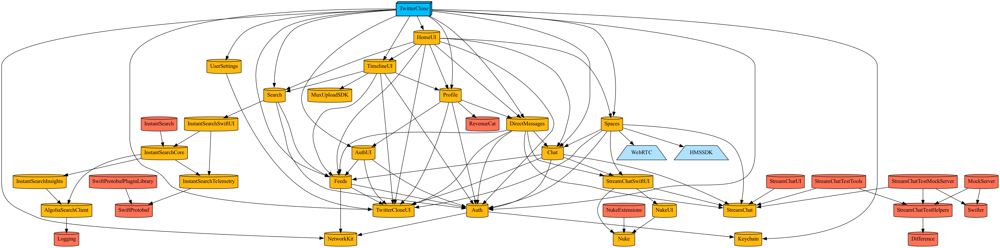

# How To Launch A Twitter Competitor On the App Store In Days
Leverage API components to build a fully functioning Twitter clone

## Key Features
| Partners | Main Features | Description | Preview |
|---------------|---------------|-------------|---------|
|  | Homepage timeline feeds     | Stream Feeds and the React Activity Feeds SDK from Stream to create a mobile clone of Twitter.    |  |
|  |   Twitter Spaces   | Create an audio room for conversations     |  |
|  | Search & Follow Users     | Build a fully functional search to find and follow users using Algolia's search API     |  |
|  | Media upload     | Tweet with video     |  |
|  | Twitter Blue     | In-app subscriptions     |  |


# Node backend
Please run the Node sample backend from this Git repository: [GetStream/stream-node-simple-integration-sample](https://github.com/getstream/stream-node-simple-integration-sample/)

# iOS Frontend

The folder TwitterClone contains the iOS codebase

To get started with it, you need to install Tuist and run `tuist generate` in the directory `TwitterClone`. Then open the `TwitterClone.xcworkspace` file.

[](https://tuist.io)


## To install Tuist on your system:

Run:
```shell
curl -Ls https://install.tuist.io | bash
```

## Fetching external dependencies

When you get freshly cloned this repository or dependencies have been updated. Run:

```shell
tuist fetch
```

## Generate and open project files
To generate the Xcode project files and open the project in Xcode, run:
```shell
tuist generate
```

# iOS package graph
We work towards a µFramework based packaging system



To generate a fresh graph, in case you updated the project's package structure or dependencies. Run:

```shell
tuist graph --skip-test-targets
```

